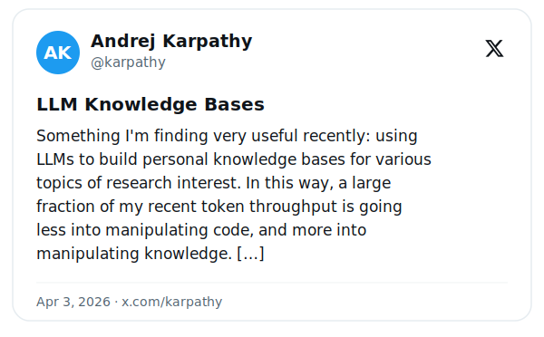

<div align="center">

# 🧠 Chitta

### Permanent memory for AI coding agents. Zero LLM tokens, ever.

One SQLite file that remembers everything your agent learns - across sessions, forever -
and grows it into a living knowledge graph. Fully local. ~100 ms recall. $0 per query.

<p>
  <a href="https://www.npmjs.com/package/@100xprompt/chitta"></a>
  <a href="https://github.com/Nipurn123/chitta/actions/workflows/ci.yml"></a>
  
  
  
  
</p>

**[Install](#install)** · **[See it remember](#see-it-remember-30-seconds)** · **[Benchmarks](#benchmarks--performance)** · **[SDK](docs/SDK.md)** · **[Architecture](ARCHITECTURE.md)** · **[vs mem0 / Zep](#how-chitta-compares)**

<a href="docs/assets/chitta-graph.mp4"></a>

<sub>A real Chitta knowledge graph - 285 concepts, 291 relationships, colored by type, labeled hubs. <a href="docs/assets/chitta-graph.mp4">▶ full-quality MP4</a> · make your own with <code>chitta graph --open</code></sub>

<!-- LANG-PICKER-START -->
<details>
<summary><b>🌐 Read this in 22 languages</b></summary>
<p>
  <a href="docs/translations/README.zh-CN.md">简体中文</a> ·
  <a href="docs/translations/README.zh-TW.md">繁體中文</a> ·
  <a href="docs/translations/README.ja-JP.md">日本語</a> ·
  <a href="docs/translations/README.ko-KR.md">한국어</a> ·
  <a href="docs/translations/README.hi-IN.md">हिन्दी</a> ·
  <a href="docs/translations/README.bn-IN.md">বাংলা</a> ·
  <a href="docs/translations/README.es-ES.md">Español</a> ·
  <a href="docs/translations/README.fr-FR.md">Français</a> ·
  <a href="docs/translations/README.de-DE.md">Deutsch</a> ·
  <a href="docs/translations/README.pt-BR.md">Português</a> ·
  <a href="docs/translations/README.ru-RU.md">Русский</a> ·
  <a href="docs/translations/README.ar-SA.md">العربية</a> ·
  <a href="docs/translations/README.fa-IR.md">فارسی</a> ·
  <a href="docs/translations/README.it-IT.md">Italiano</a> ·
  <a href="docs/translations/README.tr-TR.md">Türkçe</a> ·
  <a href="docs/translations/README.vi-VN.md">Tiếng Việt</a> ·
  <a href="docs/translations/README.id-ID.md">Bahasa Indonesia</a> ·
  <a href="docs/translations/README.pl-PL.md">Polski</a> ·
  <a href="docs/translations/README.uk-UA.md">Українська</a> ·
  <a href="docs/translations/README.nl-NL.md">Nederlands</a> ·
  <a href="docs/translations/README.th-TH.md">ภาษาไทย</a>
</p>
</details>
<!-- LANG-PICKER-END -->

</div>

***Chitta*** (चित्त) - in Indian philosophy, the mind's storehouse where every impression is
kept. **Permanent memory for your AI coding agent**, by **[100xprompt](https://github.com/Nipurn123)**.

Your coding agent forgets everything between sessions - every morning you re-explain your
project, your stack, your preferences to a tool with amnesia. Chitta gives it a **permanent,
local brain**: it **remembers across sessions**, builds a **knowledge graph** of what it learns,
runs **fully offline on one SQLite file**, and spends **zero LLM tokens** to store or recall.
One command wires it into the agent you already use (Claude Code, Cursor, Codex - **17 tools**),
or import it as an embeddable **SDK**.

## Why this is the most advanced memory layer you can run

| | |
|---|---|
| ⚡ **Zero LLM tokens, ever** | Local embeddings + deterministic extraction handle store *and* recall. Typical memory layers burn ~6,900 tokens per query; Chitta burns **0**. Free at any scale. |
| 🧠 **Remembers across sessions** | One SQLite file survives restarts, new chats, new weeks. Tell it once; it knows forever. |
| 📉 **Up to 143× less context** | Hands your agent the ~181 tokens that matter instead of dumping 25,864 into the prompt (measured on LoCoMo; grows with your corpus). |
| 🕸️ **A mind you can see** | Every fact becomes typed entities + relations. `chitta graph --open` renders your agent's memory as an interactive constellation. |
| 🧬 **Self-correcting** | "Sarah moved to Meta" supersedes "works at Google" - confidence-aware belief revision, contradiction detection, history kept. No LLM involved. |
| ⏳ **Reasons over time** | Bi-temporal store: how a subject *evolved*, and exactly what was believed **as of** any past date. |
| 🔒 **Permission-aware to the core** | The ACL decides the candidate set *before* the vector index is touched. One shared graph, per-user visibility, leak-proof by construction. |
| 🛠️ **One command, 17 tools** | Installs as an MCP server + Skill into Claude Code, Cursor, Codex, Windsurf, Zed and more - or import the SDK directly. |
| 🔐 **Encrypted, audited, yours** | Optional AES-256 at rest with key rotation, a tamper-evident audit log, and nothing - ever - leaving your machine. |

```ts
import { Chitta } from "@100xprompt/chitta"
const memory = new Chitta({ path: "./memory.db" })
await memory.remember("Sarah works at Meta.", { relations: [{ from: "Sarah", to: "Meta", type: "works_at" }] })
await memory.recall("where does Sarah work?")     // hybrid, reranked, local - zero LLM tokens
```

**→ Full SDK guide: [docs/SDK.md](docs/SDK.md)** (multi-tenant ACL, typed graph, self-correction, temporal, scaling flags).

Point your agent at it once, and every session can **store, recall, and reason over** what you
told it before - so you stop repeating yourself.

**Works solo, scales to your team.** The same store is **permission-aware** - point it at a
shared backend and your whole team works off one graph, each person seeing only what their
access allows (the part every other memory layer treats as an afterthought).

> **Architecture & internals:** see [ARCHITECTURE.md](ARCHITECTURE.md).

- **Local mode (default):** one SQLite file. Ingest, extract a knowledge graph, retrieve - no servers.
- **Central-office mode:** point it at a shared backend (ArangoDB + Qdrant + embeddings) via env; the
  whole org shares one graph, each user sees only what their ACL permits.

## The idea behind Chitta

We didn't invent this idea - we made it free. In April 2026, Andrej Karpathy described shifting his
token budget from *"manipulating code"* to *"manipulating knowledge"*: use an LLM to **compile** your
source docs into a structured wiki (summaries, backlinks, concepts), then ask questions against it
instead of re-reasoning every time.

<p align="center">
  <a href="https://x.com/karpathy/status/2039805659525644595"></a>
</p>
<p align="center"><sub>Andrej Karpathy on LLM knowledge bases - <a href="https://x.com/karpathy/status/2039805659525644595">the tweet</a>. His general take on the approach, not an endorsement of Chitta.</sub></p>

**Chitta is that idea, automated - and zero-token at both ends.** Karpathy hand-drives an LLM to
compile and maintain the wiki (which is *why*, in his words, so much of his token throughput now goes
into it) - single-user, in Obsidian, at what he calls *"~small scale."* Chitta does the same job -
turn what your agent sees into a queryable knowledge base - but the compilation is **deterministic**
(no LLM at write *or* read), **permission-aware** across a shared graph, and built to scale past small.
He even says it himself: *"I thought I had to reach for fancy RAG."* **Chitta is what you reach for
when you outgrow letting an LLM hand-maintain markdown.**

## See it remember (30 seconds)

The whole point, in one command - **two separate processes** sharing one file. Session 1 learns
a few things and exits; a brand-new session 2 opens the same file and *remembers*:

```bash
bun install
./examples/agent-memory/run.sh
```

```
SESSION 1  ── learns 5 things → writes ./agent-memory.db → process exits ──
  remembered  Chitta runs on Bun and stores everything in bun:sqlite…
  remembered  Nipurn prefers TypeScript with 2-space indentation and no semicolons…
  → persisted: 5 records · 10 entities · 5 chunks · then the process is gone

SESSION 2  ── a brand-new process, the SAME file ──
  BEFORE  Q: what does Chitta run on?   A: ¯\_(ツ)_/¯  I just started up, no idea.
  AFTER   Q: what does Chitta run on?   A: Chitta runs on Bun and stores everything in
                                           bun:sqlite - no servers, fully local.   (0.294)
          Q: what indentation does Nipurn prefer?
                                        A: TypeScript, 2-space indentation, no semicolons.  (0.263)

  KNOWLEDGE GRAPH  (rebuilt from the file, not an LLM)
     Chitta ──runs_on──▶ Bun            Chitta ──written_in──▶ TypeScript
     Chitta ──stores_data_in──▶ bun:sqlite     Nipurn ──prefers──▶ TypeScript
```

Session 2 never saw session 1 run - it just opened the file, recalled the facts, and rebuilt the
graph. That's cross-session memory: **zero tokens, fully local**. Full walkthrough:
[examples/agent-memory](examples/agent-memory/).

## Learn an entire repository (60 seconds)

Point it at a folder: code is parsed with tree-sitter (36 languages) into a code graph,
docs into the concept graph - and unlike one-off repo analyzers, the result is **permanent
memory** your agent recalls in every future session:

```bash
chitta learn .            # add --open to see the graph it built
```

```
Chitta learned this repository

  files        288 ingested (231 code · 57 docs) · 13 skipped (generated/binary/large)
  languages    typescript 208 · markdown 57 · tsx 12 · json 5 · javascript 2 · bash 2 ...
  this repo    2528 concepts · 7535 relationships · 53 clusters (+288 new records in the store)
  time         11.3s · zero LLM tokens
```

Real run, this repo. Then ask your agent *"where is the security invariant enforced?"* -
today or in three weeks - and it answers from this graph. Re-running supersedes each file's
contribution (stable ids), so `chitta learn .` after a refactor just updates what changed.
Also on the SDK: `await memory.learn("./my-repo")`.

## The team moat: permission-aware in 30 seconds

When you *do* add teammates, the same store enforces who-can-see-what. Two users, one store,
three documents - each sees only what they're allowed to:

```bash
bun install
./examples/permission-aware-retrieval/run.sh
```

```
ALICE (org handbook + her roadmap; NOT comp):
  • [Company Handbook]  Acme builds privacy-first AI infrastructure…
  • [Eng Roadmap]       Q3 roadmap: ship the permission-aware retrieval engine…

BOB (org handbook + his comp; NOT roadmap):
  • [Company Handbook]  Acme builds privacy-first AI infrastructure…
  • [Comp Bands]        Compensation bands for 2026. Senior engineers: 180-220k…
```

Same query, different results - because the ACL graph produces the candidate set *before*
the vector index is touched. Full walkthrough: [examples/permission-aware-retrieval](examples/permission-aware-retrieval/).

**Benchmark:** on a small permission-scoped knowledge base, retrieval delivers
**7.4× fewer tokens** than dumping the whole corpus into context (more as the corpus
grows) - with **zero cross-user leak**. Reproducible: [examples/token-reduction](examples/token-reduction/).

## How Chitta compares

The honest, fully-sourced version (every competitor claim linked) is in
[docs/launch/comparison.md](docs/launch/comparison.md). The short version:

| | **Chitta** | **mem0** | **Zep / Graphiti** | **supermemory** |
|---|:--:|:--:|:--:|:--:|
| **Zero LLM tokens** to store & recall | ✅ | ❌ | ❌ | ❌ |
| **Runs fully local** (no cloud LLM) | ✅ | ⚠️ | ⚠️ | ✅ |
| **Permission-aware ACL** on a *shared* graph | ✅ | ❌ | ⚠️ | ⚠️ |
| **Knowledge graph** | ✅ | ⚠️ | ✅ | ✅ |
| **Installs into AI coding tools** (MCP) | ✅ 17 | ✅ | ✅ | ✅ |
| **License** | MIT | Apache-2.0 | Apache-2.0 | MIT |

<sub>⚠️ = partial, or a different mechanism (e.g. per-user graph *isolation* rather than filtered visibility on one shared graph). Full nuance + sources: [comparison.md](docs/launch/comparison.md).</sub>

**On accuracy benchmarks:** everyone measures differently - competitors publish *with-LLM* QA accuracy (an LLM reads the memory and answers the question), while Chitta's **0.552 on LoCoMo** is a **zero-token recall** number. Different scale - and the competitors' figures are themselves publicly disputed. We don't claim to "beat" anyone on a contested metric; we do the job at **zero tokens**. See [the full comparison](docs/launch/comparison.md).

## Install

Chitta runs on [Bun](https://bun.sh) (install once: `curl -fsSL https://bun.sh/install | bash`).
One command then wires it into your AI tools - as an **MCP server** (everywhere) and a
**Skill** (where supported):

```bash
bunx @100xprompt/chitta install                 # auto-detect installed tools
bunx @100xprompt/chitta install --all           # every supported tool
bunx @100xprompt/chitta install --platform cursor,claude-code
bunx @100xprompt/chitta install --print         # just print the MCP config to paste anywhere
```

**Configure at install time** (every flag is baked into the tool's MCP `env` block, so it
works the same across all tools):

```bash
bunx @100xprompt/chitta install --platform claude-code \
  --user-id alice --org-id acme --role editor --groups eng,sec \
  --embeddings real --memory-ttl 30 --audit          # identity, ACL, real embeddings, TTL, audit log
bunx @100xprompt/chitta install --db-key "$KEY"      # encryption at rest (also: bun add libsql)
```

Flags: `--user-id --org-id --role --groups` (identity/ACL) · `--db <path>` ·
`--embeddings auto|real|hash --embed-model` · `--db-key` (encryption) · `--audit`
(tamper-evident log) · `--memory-ttl <days>` · `--llm-url --llm-model` · `--topk --rerank 0`.
Other: `--project` (project-scoped) · `--list` · `uninstall`.

**Check your setup any time:**

```bash
bunx @100xprompt/chitta doctor   # identity, storage, encryption, ANN, audit, embeddings, counts
```

**Optional extras** (kept out of the default install so `bunx` stays lightweight - the core
runs great with the built-in fast hashing embedder):
- Real semantic embeddings: `bun add @huggingface/transformers` then set `CONTEXT_EMBEDDINGS=real`
  (the default `auto` already uses them when present, else falls back to hashing).
- Encryption at rest: `bun add libsql` then set `CONTEXT_DB_KEY=<key>` (transparent AES whole-file).

**Supported tools (17):** Claude Code, Claude Desktop, Cursor, VS Code (Copilot), Windsurf,
Zed, Cline, Roo Code, Codex CLI, Gemini CLI, opencode, Continue.dev, Goose, Kiro, Amp,
Factory Droid, Kilo Code.
Skill (not just MCP) is installed for the ones that support it (Claude Code, Cursor, Gemini,
opencode, Kiro, Amp, Factory, Kilo, Trae). Any other MCP client: `--print` and paste.

> Published to npm as `@100xprompt/chitta` and run via `bunx` (the Bun runtime ships SQLite +
> the vector index in-process, so there are no native build steps for users).

## Tools exposed over MCP

| Tool | Does |
|---|---|
| `context_ingest` | Store text → record node + **permission edges** (ACL) + **vector chunks** + **canonical concept graph** + **atomic memories** (semantic facts, **episodic** experiences, **procedural** how-tos) |
| `get_context` | Retrieve ranked, cited, permission-filtered snippets + the **current memory** (contradiction-resolved) + relevant experiences + applicable preferences |
| `context_forget` | Forget memories that are no longer true/wanted (soft-delete, within what you may see) |
| `context_profile` | Synthesize a profile of a person/org/entity (permanent + recent facts + connections) |
| `context_graph` | Return the knowledge graph (concepts + relationships) the user can access |
| `context_relate` | Graph queries over the entity graph (neighbors / path / impact / central / communities) |
| `context_timeline` | **Reason over time** - how a subject evolved, or the facts believed **as of** a past date |
| `context_reflect` | **Reflect** - synthesize higher-order insight (recurring focus, what changed, preferences, recent activity) |

## Operate (CLI)

```bash
chitta doctor                      # config + health: identity, encryption, ANN, audit, counts
chitta learn . --open              # walk a repo → permanent memory (code graph + concepts) + report
chitta graph --open                # → a self-contained interactive HTML of everything your agent remembers
chitta sleep                       # sleep-time consolidation: dedupe entities, retire expired, re-weight
chitta bench synthetic             # measure memory quality (retrieval + end-to-end QA) - see docs/BENCHMARKING.md

# audit log (enable with CHITTA_AUDIT=1)
chitta audit                       # recent entries (who/what/when)
chitta audit --verify              # check the hash chain is intact (tamper-evident)

# encryption key rotation - the CURRENT key comes from CONTEXT_DB_KEY (not a flag)
chitta rekey --new-key "<key>"                 # encrypt a plaintext store
CONTEXT_DB_KEY="old" chitta rekey --new-key "new"   # rotate to a new key
CONTEXT_DB_KEY="key" chitta rekey --new-key ""      # decrypt back to plaintext
```

Encryption + rotation need the optional driver once: `bun add libsql`.

## Living memory (permission-aware)

Beyond storing snippets, Chitta maintains a **living-memory layer with a real cognitive
model** - the part most memory products treat as proprietary magic, here done natively and
**ACL-scoped**:

- **Canonical graph (coreference)** - "Sarah", "Sarah Chen" and "Ms. Chen" fold into one
  entity, so the graph doesn't fragment and a contradiction stated under a *different surface
  form* still resolves.
- **A memory typology, not just chunks** - **semantic** facts ("Sarah works at Meta"),
  **episodic** experiences (time-anchored events with actors, recalled by relevance × recency),
  and **procedural** how-tos/preferences (trigger → action).
- **Self-correcting** - contradictions supersede (`works_at`: Google → Meta; history kept);
  belief revision is **confidence-aware** (a weak claim can't overwrite a confident one);
  **semantic contradictions** are caught beyond single-valued facts (`likes` vs `dislikes`);
  importance is scored at write; a **sleep-time pass** (`chitta sleep`) dedupes, retires, and
  re-weights by corroboration.
- **Reasons over time** - `context_timeline`: how a subject evolved, or the facts believed
  **as of** a past date (the store is bi-temporal).
- **Reflects** - `context_reflect`: synthesizes higher-order insight (recurring focus, what
  changed, preferences, recent activity) over what you're permitted to see.
- **Forgetting** - `context_forget` soft-deletes by description; optional TTL
  (`CONTEXT_MEMORY_TTL_DAYS`) retires dynamic memories, static facts are exempt. Coherent:
  the underlying graph fact is expired too.
- **Permission-aware throughout** - you can only recall, reflect on, or forget what your ACL
  permits, across a *shared* org graph. (Most memory layers only isolate per-user pools - they
  have no concept of "who is allowed to remember what" inside a team.)

## Run it

```bash
bun install
bun start                         # boots the MCP server (stdio)
bun test                          # 369 tests
bun run build                     # → dist/chitta (single binary)
```

## Use it from any MCP client

```jsonc
{
  "mcp": {
    "context": {
      "type": "local",
      "command": ["bun", "run", "/path/to/chitta/src/mcp/server.ts"],
      "environment": { "CONTEXT_USER_ID": "alice", "CONTEXT_ORG_ID": "acme" }
    }
  }
}
```

**Central office:** add the shared backend URLs so everyone queries one graph with per-user ACL:

```jsonc
"environment": {
  "CONTEXT_USER_ID": "alice", "CONTEXT_ORG_ID": "acme",
  "CONTEXT_ARANGO_URL": "https://office.internal/arango",
  "CONTEXT_QDRANT_URL": "https://office.internal/qdrant",
  "CONTEXT_EMBED_URL": "https://office.internal/embed",
  "CONTEXT_COLLECTION": "records"
}
```

## How it works

```
ingest → record node + permission edges (ACL)      ┐
       → chunk + embed → vectors                    ├─ all in one SQLite file (local)
       → extract entities + relations → graph       ┘
query  → ACL: which records may this user see?  (graph traversal)
       → vector search restricted to those records
       → cross-connector leak guard → cited snippets
```

## Storage (local mode)

One file at `$CONTEXT_DB` or `~/.local/share/100xprompt/context.db`:
- `nodes` - graph vertices (records, users, orgs, **entities**)
- `edges` - relationships (`permissions`, `belongsTo`, `mentions`, `relates_to`)
- `chunks` - text + embedding vectors (Float32 BLOB)
- `vec_chunks` / `vec_native` - **ANN index** (sqlite-vec when plaintext, libSQL native DiskANN when encrypted)

## Vector search - adaptive + fast (in-process)

Three paths, same interface, picked automatically (`store.annEnabled` reflects which is live):

- **Plaintext, extension-capable SQLite →** loads **[sqlite-vec](https://github.com/asg017/sqlite-vec)**
  (`vec0`, in the same file).
- **Encrypted (`CONTEXT_DB_KEY`) →** libSQL **native DiskANN** vector index
  (`F32_BLOB` + `libsql_vector_idx` + `vector_top_k`) - real ANN *inside the encrypted file*,
  no extension to load. Encryption no longer costs you ANN.
- **Fallback (no index available) →** fast brute-force cosine in TS.

The brute-force path is engineered for low latency: embeddings are stored as compact
**Float32 BLOBs** (no `JSON.parse` per query - decoded zero-copy), scored by **dot product**
(== cosine for normalized vectors), kept with a **bounded top-k** selector (no full sort).
Measured ~1.4 ms @1k and ~15 ms @10k vectors; the ANN paths stay sub-ms well beyond that.
Read pragmas (256 MB page cache, mmap on plaintext, WAL) keep steady-state queries hot.

## Benchmarks & performance

All numbers **measured this release** on a dev laptop (hash embedder unless noted; ratios, not SLAs). Full detail + caveats in [docs/PERFORMANCE.md](docs/PERFORMANCE.md).

### Retrieval quality - at **zero LLM tokens**

| Benchmark | Metric | Chitta | Notes |
|---|---|--:|---|
| **LongMemEval** | recall@10 (Tier-A) | **0.782** | session-level evidence |
| **LoCoMo** | recall@10 (Tier-A) | **0.552** | 1,986 Q · `bge-small` · rerank + wide pool (default) |
| **LoCoMo** | nDCG@10 / MRR | 0.422 / 0.408 | single-hop **0.66** · multi-hop 0.29 |
| **LoCoMo** | context reduction | **143×** | 181 vs 25,864 tokens/question |

Retrieval is fully **LLM-free** and hands the reader **~180 tokens instead of 25,864** (143× less). Competitors post 90%+ on *end-to-end QA* (an LLM reads the memory and answers) - e.g. Mem0 at **~6,900 tokens/query**; Chitta spends **0**. Compare accuracy *at token cost*. LoCoMo/LongMemEval are casual conversation, where zero-token typed extraction is naturally starved; for the head-to-head number, **benchmark mode** (`CONTEXT_LLM_URL=…`) ingests via an LLM extractor like the competitors - see [docs/BENCHMARKING.md](docs/BENCHMARKING.md).

### Graph retrieval - **O(1) in graph size**

```
query latency @100K-record graph        (lower is better)
bounded   O(1)   ▏ 0.05 ms
unbounded O(N)   ████████████████████████████████████████ 2.0 ms  →  39× slower, and widening
```
Flat ~0.05 ms from 50K→100K; recall held (+0.6% vs unbounded). `CONTEXT_GRAPH_BOUNDED` (default on).

### Ingest - **O(N²) → ~O(N log N)**

```
per-record ingest @8K records            (lower is better)
before  O(N²)     ████████████████████████████████████████ 25.7 ms   (20K used to time out)
now   ~O(N log N) ██ 1.14 ms                                          ≈ 22× faster
```

| records | before (O(N²)) | now (~O(N log N)) |
|--:|--:|--:|
| 1K | 2.25 ms/rec | 0.60 ms/rec |
| 8K | 25.7 ms/rec | 1.14 ms/rec |
| 16K | *(timed out)* | 1.72 ms/rec |

### Dense vector - sub-linear both ways

```
dense ANN query @100K vectors            (lower is better)
vec0 (default)    ████████████████████████████████████████ 51 ms
DiskANN (opt-in)  ██████ ~8 ms                                        ≈ 6× faster, flat
```

| corpus | vec0 (default) | DiskANN (`CONTEXT_DISKANN=1`) |
|--:|--:|--:|
| 3K | 1.6 ms | 8.4 ms |
| 18K | 9.7 ms | 8.1 ms |
| 100K | 51 ms | ~8 ms |

- **Filtered-ANN** (default, scoped users): dense search is **O(accessible), not O(corpus)** - leak-proof by construction, exact (**Δrecall = 0**), ~4.6× faster for a scoped user at a 12K corpus.
- **DiskANN** is opt-in for *large, read-heavy* corpora: sub-linear query (0.98 recall vs exact), but ~80× slower ingest and an ~8 ms floor - vec0 wins below ~15-18K.

## Status

Implemented: ACL graph, vector store, retrieval + leak guard, **knowledge-graph extraction**, MCP server
(local + central), fetch-based Arango/Qdrant/embedding adapters. All dependency-free except the MCP SDK.

Next (swap-in, same interfaces): real embeddings (transformers.js ONNX `bge-*`) for semantic ranking;
GraphRAG retrieval (expand results along `relates_to` edges); LLM-based entity extraction for higher recall.

See [ARCHITECTURE.md](ARCHITECTURE.md) for module-by-module internals and the security invariant.

## Docs

- [ARCHITECTURE.md](ARCHITECTURE.md) - pipeline, module map, security invariant, extending it
- [docs/BENCHMARKING.md](docs/BENCHMARKING.md) - measure memory quality (Tier A retrieval + Tier B end-to-end QA; LongMemEval/LoCoMo)
- [docs/SDK.md](docs/SDK.md) - the embeddable SDK: quickstart, multi-tenant ACL, typed graph, self-correction, temporal
- [docs/API.md](docs/API.md) - complete SDK API reference: Chitta / ChittaUser, every option + return type, errors, onEvent, chittaTools
- [docs/DEPLOYMENT.md](docs/DEPLOYMENT.md) - production deployment: persistence, encryption at rest, scaling flags, multi-tenant ACL, checklist
- [docs/PERFORMANCE.md](docs/PERFORMANCE.md) - why it scales: measured graph / ingest / filtered-ANN / DiskANN numbers, with honest caveats
- [docs/adapters.md](docs/adapters.md) - use Chitta as tools in the Vercel AI SDK / OpenAI / Anthropic agent loops, or as a LangChain retriever / memory
- [docs/RELEASING.md](docs/RELEASING.md) - how to cut a release: version bump, CHANGELOG, git tag + GitHub Release → bun publish
- [examples/](examples/) - runnable demos
- [CONTRIBUTING.md](CONTRIBUTING.md) - dev setup and workflow
- [SECURITY.md](SECURITY.md) - security model and how to report issues
- [CHANGELOG.md](CHANGELOG.md) - notable changes

## Star history

<a href="https://star-history.com/#Nipurn123/chitta&Date">
  
</a>

---

<div align="center">

**🧠 Chitta** - give your agent a mind that lasts.

Built by [Nipurn Agarwal](https://github.com/Nipurn123) · [MIT](LICENSE) © 2026

**[⬆ Back to top](#-chitta)**

</div>
